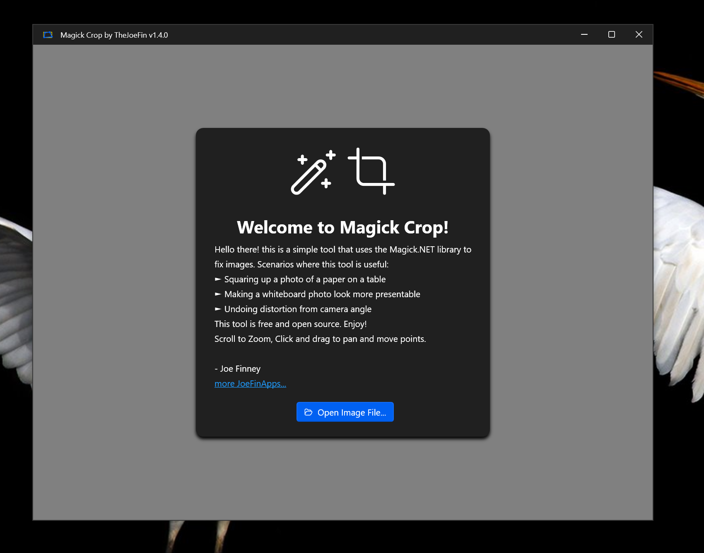
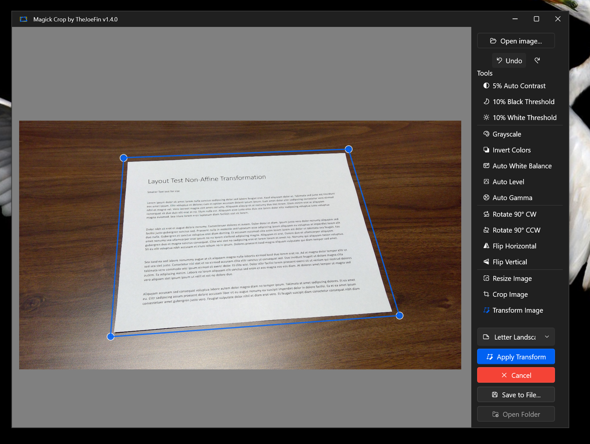

  

<h1 align="center">
  MagickCrop
</h1>

  Correct perspective distortion in photos with ImageMagick.

  

Using ImageMagick to via to correct perspective distortion in images.

## Powered by Image Magick and Magick.NET

- GitHub: https://github.com/dlemstra/Magick.NET
- Nuget search: https://www.nuget.org/packages?q=magick.net

This is a simple app which does a few things.

- Open an image
- Align to the 4 corners of the rectangular subject
- Set the Aspect Ratio with the drop down
- Save the image which will square the opened image per the selected aspect ratio
- Crop the image
- Resize the image to remove stretch
- Adjust color and contrast

If you like this app you'll probably enjoy some of my other apps: [JoeFinApps.com](https://www.JoeFinApps.com)
