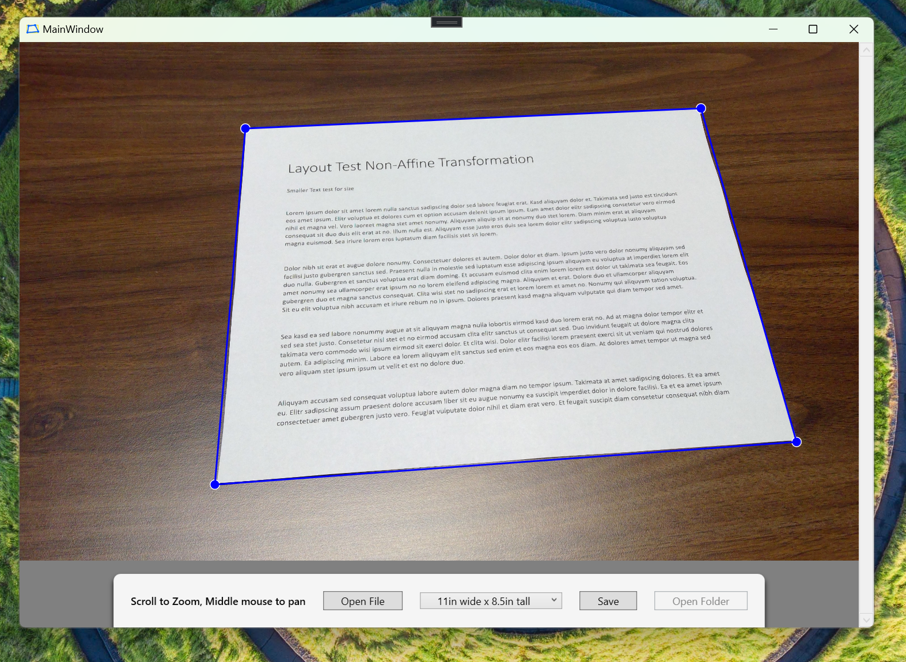

# MagickCrop

Using ImageMagick to via to correct perspective distortion in images.

- GitHub: https://github.com/dlemstra/Magick.NET
- Nuget search: https://www.nuget.org/packages?q=magick.net 

This is a simple app which does a few things.

- Open an image
- Align to the 4 corners of the rectangular subject
- Set the Aspect Ratio with the drop down
- Save the image which will square the opened image per the selected aspect ratio
